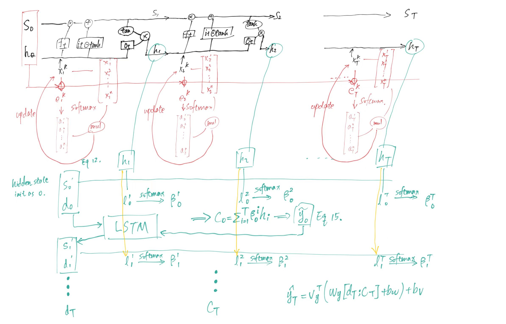

1
  

  
decomposing the process of a daRnn (Dual-Stage Attention-Based Recurrent Neural Network) model step by step
  
daRnn is a special nonlinear autoregressive network with exogenous inputs (NARX) 

  
  
  
before we start, let's get familiar with some notations to understand the shape of input data.
  
  
  

  
  
  
in which  is the number of explainary variables and  is the length of the time series.
  
  
  
**step 1**: initialize the hidden state , . their shape are both , 
  
**step 2**: calculate the similarity of ,  with  by the following equation(Eq. #8 in the paper):
  

  
  
  
while coding, we input , so we can do this for all  from  to  at the same time thanks to matrix opertion. That is . Then we softmax it (Eq. #9 in the paper) to get , so as to undate the original  (the  column in ) with:
  

  
  
  
**step 3**: pass  to a LSTM cell, together with , , to get  and , the hidden state of the next time. the detail of how LSTM works is as follows:
  

  
  
  
**step 4**: return to step 2 untill 
  
*now we already have . it's time to apply another attnetion layer. if we put these  together, which is , it's not difficult to find they have a very similar shape as .*
  
**step 5**: generate the initial hidden state , , 
  
**step 6**: here is the tricky point of daRnn, we will not calculate the similarity of hidden state and some rows of  like what we do in the first attention layer ( is a row of ). instead, we calculate the similarity of hidden state ,  and  respectively by using Eq #12 in the paper:

  
  
  
like before, we softmax , the output is 
  
**step 7**: 
  
**step 8**: pass  to a LSTM cell, together with , , to get  and , the hidden state of the next time.
  
**step 9**: return to step 6 until 
  
**step 10**: subtract the final step output 
  

  
  
  